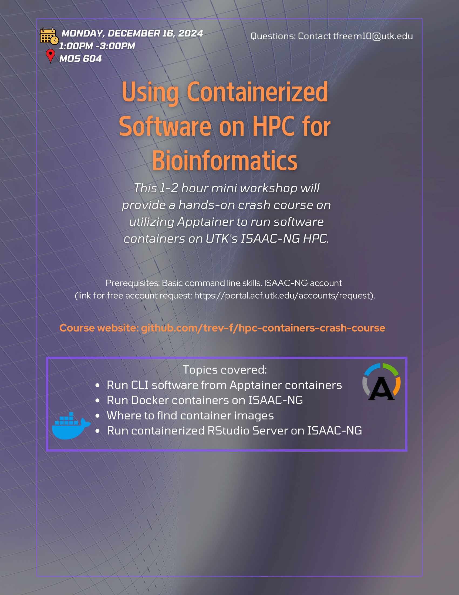

# HPC Containers Crash Course

Web page for a 1-2 hour mini workshop will provide a hands-on crash course on utilizing Apptainer to run software containers on UTK's ISAAC-NG HPC.

## Zoom

> [!NOTE]  
> We strongly recommend in-person attendance when possible.
> We intend for this workshop to include as much discussion as possible, and having as many people attend in person as possible is much better for generating discussion.
> Of course, we want this event to be inclusive and archived for people who are unable to attend a synchronous session, so we are offering a Zoom session with plans to host the recording.

[COMING SOON]
[Zoom link -- Synchronous session]()

[COMING SOON]
[Zoom link -- Hosted recording]()
